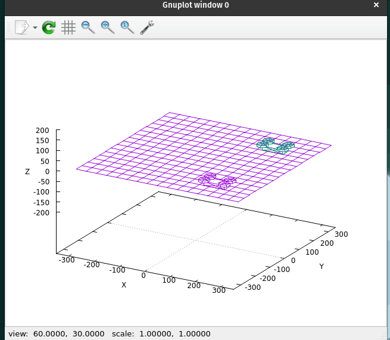

# Zadanie 5 Dron na Tytanie Faza 1
## Wykonane zadania
- Możliwość dodawania wielu dronów
- Każdy element sceny animuje się jednocześnie
- Każdy obiekt może poruszać się w tym samym czasie, czyli można ruszać kilkoma dronami na raz
- Menu i wyświetlanie animacji jest stworzone na dwóch oddzielnych wątkach dlatego jest możliwość zadawania poleceń dronom podczas animacji
- Zliczanie aktualnych i wszystkich Vector3 na scenie
- Zmiana koloru aktywnego drona
- Lot zwiadowsczy


@image html ./img/3drones.gif
## Budowanie

``` bash
git clone https://github.com/KPO-2020-2021/zad5_1-delipl.git # Cloning repository
cd zad5_1-delipl

mkdir lib/  # Download doctest lib
cd lib
git submodule add https://github.com/onqtam/doctest.git
cd ../

mkdir build tmp && cd build
cmake ..           # options: -DCMAKE_BUILD_TYPE=[Debug | Coverage | Release], Debug is default
make fulltest      # Makes and runs the tests.
make doc

make app           # build and run
```

## Dokumentacja
Dokumentacja po zbudowaniu znajduje się w build/html/index.html

``` bash
firefox html/index.html
```